# Miata MX5 Quick Start Guide

So, you've just got yourself a shiny new BMM MX5 Miata ECU for your NA or NB, nice! If you're wondering how to install and get it running, you've come to the right place. This guide will cover how to install the ECU to the car with a Bosch LSU 4.9 wideband oxygen sensor and a mass air pressure (MAP) line. Installation of additional sensors or peripherals is covered in the advanced guides.

> **_NOTE:_**  Before commencing the ECU installation, it is recommended to jack up the car or drive it onto ramps in the case when the oxygen sensor location is under the vehicle.

## Required Tools and Components

- BMM Miata ECU
- BMM wideband adapter harness
- BMM options port pigtail
- Genuine Bosch LSU 4.9 oxygen sensor
- 3 metres of silicone vacuum hose 5/32" or 4mm internal diameter
- 4mm straight barb joiner
- 22mm wrench or 22mm oxygen sensor socket
- Timing light
- USB cable (included with ECU)
- Windows, Mac or Linux laptop with an installed copy of [EFI Analytics TunerStudio](https://www.tunerstudio.com/index.php/tuner-studio)
- Spanner and socket set

## Removing Original ECU

The stock ECU location for a Miata will be in one of three spots depending on the driving side and year:

### Left Hand Drive NB

The ECU can be found above the pedals, next to the steering column.

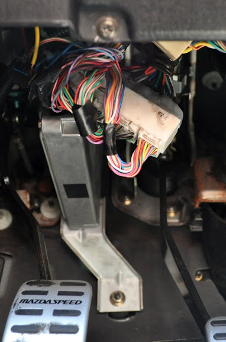

### 90-93 Left Hand Drive NA and Right Hand Drive NA/NB

The ECU can be found under the carpet in the passenger side footwell. To access this, the carpet needs to be unhooked from the vertical trim piece on the edge closest to the passenger door. Removing this trim piece can also simplify access. The ECU kick plate will also need to be removed after taking off the five 10mm nuts and bolts holding it in place.

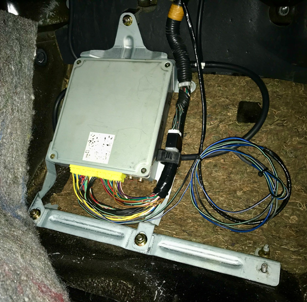

### 94-97 Right Hand Drive NA

The ECU can be found behind the passenger's seat, under the carpet. Move the seat forwards all the way. Next, the passenger door sill needs to be removed with a philips head screwdriver so that the carpet towards the back of the seat can be pulled back to reveal the ECU.

Once the ECU has been located on your Miata, disconnect the car battery then remove all electrical plugs to the ECU. Un-bolt any remaining ECU mounting brackets from the car with a 10mm socket and the ECU should now be free from the car. The last step is to use a philips head to remove the factory ECU mounting brackets from the stock ECU case for these will be needed to mount the BMM ECU.

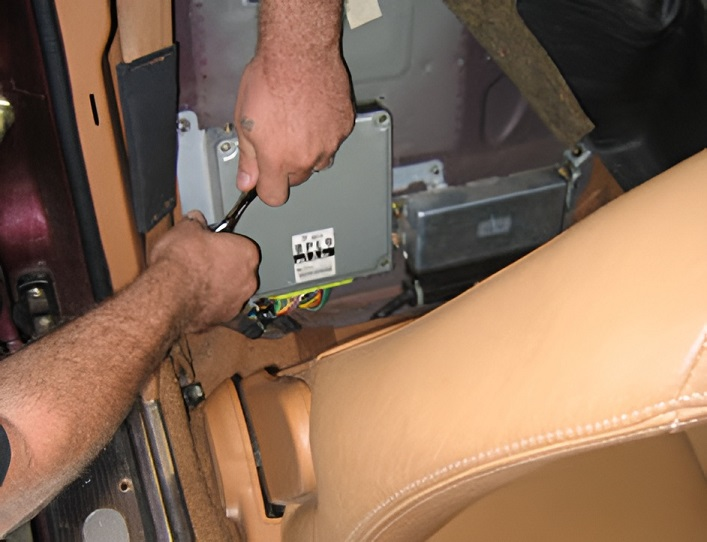

## Connecting Wideband Oxygen Sensor

> **_NOTE:_**  It is imperative that you use a genuine Bosch LSU 4.9 sensor rather than a cloned product. A fake LSU 4.9 will not provide accurate readings and can cause a lot of headaches down the track. The best way of avoiding a fake sensor is to buy directly from a reputable supplier of vehicle parts rather than generic large online re-sellers. Typical part numbers for this Bosch sensor include: 17025, 17212, 17123 and 17217. The notable difference between these part numbers is the cable length so it is recommended to measure what length you need ahead of time.

Find the factory oxygen sensor on the exhaust and unplug it from the wiring harness. In the case that the car has multiple oxygen sensors, the one to remove is the closest sensor to the engine block before any catalytic converters. Next, unscrew the sensor and replace it with a Bosch LSU 4.9 wide-band sensor. Connect the sensor to the BMM wideband adapter harness. The trailing end of the harness will need to be fed through the firewall into the cabin. The easiest way of doing this, as shown in the image below, is to cut a hole in the nearest firewall bung to the stock ECU location, and feed the cable through that. Cable tie the wiring away from any hot areas of the engine bay. Inside the cabin, connect the wideband adaptor harness plug to the options port pigtail and plug it into the ECU.

### Using an External Wideband Controller

In the case you wish to use an external wideband controller such as an _AEM X-Series Wideband UEGO AFR Sensor Controller Gauge_, the wideband sensor should be plugged into the wideband controller instead of directly into the ECU. The best way to wire in the controller is directly to the old narrow band oxygen sensor plug on the car based off the diagram below. In this diagram, pin 1 goes to the controller analogue output, pin 2 to the signal ground, pin 3 to the controller 12V input and pin 4 to the other controller ground (if applicable). Make sure to double check the voltages on the pins before connecting the controller to them. The external controller also requires additional setup in Tuner Studio which will be covered later.

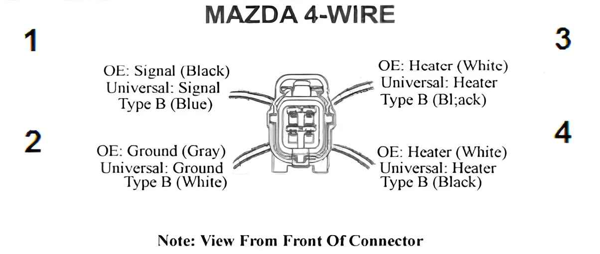

## Connecting MAP Line

Look around the intake manifold for any spare vacuum ports that lie after the throttle body and connect the vacuum line. If there are no spare ports, pick one and attach the vacuum line to it using a tee piece. It is recommended but not required to cable tie the vacuum line to the tee. In the image below, there was a free vacuum port on the back of the intake manifold which has been tee'ed off into the MAP line and the blow off valve line (only applicable on turbo charged vehicles).

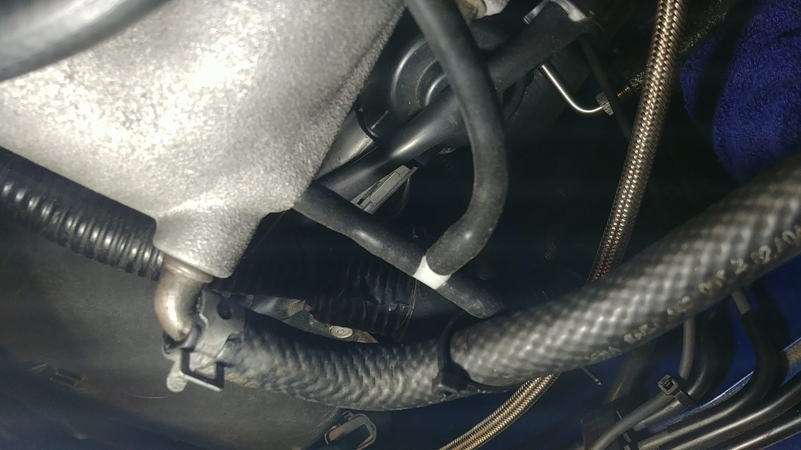

Like the oxygen sensor, feed the line through the bung in the firewall to the ECU. If you have a 4mm barb joiner, connect the vacuum line to the vacuum line protruding from the BMM ECU case. If you do not have a barb joiner, open up the BMM ECU case with a philips head and feed the vacuum line through the case. Mock up the position of the case in the car before cutting the vacuum line to length. Pull the vacuum line onto the MAP sensor on the ECU (the sensor with the nipple on it pictured below) and optionally fasten it with a small cable tie. The ECU can now be put back into its case.

Using the MAP line combined with an intake air temperature (IAT) sensor, the BMM ECU can run the car using what is known as speed-density air metering. This means that you can unplug the mass air flow (MAF) sensor or the air flow meter (AFM) for the NA 1.6L vehicles. Removing these sensors and replacing them with a pod filter directly to the intake can even result in a fractional power increase from the reduction in intake restriction.

## Additional Steps for NA6 Vehicles

The NA6 1.6L vehicles which use an AFM instead of a MAF require a few additional modifications to run with a BMM ECU. A manual NA6 do not have a variable throttle position sensor (TPS) like the automatic NA6, later model NAs and all NBs. An NA6 also needs an external intake air temperature (IAT) sensor wired in as the AFM which has one inside is typically removed. They also require a jumper for the ECU to control the fuel pump which was previously the job of the air flow meter.

The first step is to disconnect the factory TPS sensor. **This is very important or it will cause a short circuit later.**. The TPS sensor location is shown in the image below.

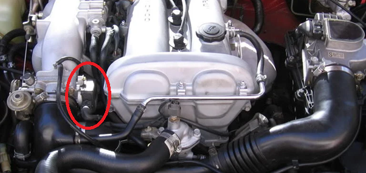

The BMM ECUs for this vehicle include a KIA TPS and adapter. The KIA TPS will plug straight to the OEM TPS plug without any additional wiring. If using another variable TPS that requires re-wiring, the NA6 TPS connector pinout is as follows:

| **Function** | **Cable Colour** |
|--------------|------------------|
| Signal       | Green/White      |
| Ground       | Black/Green      |
| 5V Reference | Red              |

The next step is to wire up the IAT sensor and to add a jumper wire to the AFM connector as per the wiring diagram below. Any IAT sensor with two wires can be used although a GM IAT sensor is recommended as ECU-tech already has a configuration for it. As the IAT is a resistance-based sensor, the orientation of the wires does not matter.

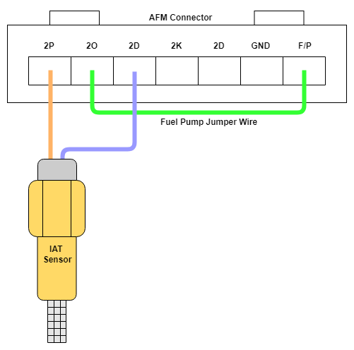

## Connecting the ECU

Now that the MAP line and wideband are connected to the ECU, the remaining wiring harness plugs from the OEM wiring loom can be plugged into the ECU. Take the factory ECU mounts and attach them to the BMM ECU case. The ECU can now be re-installed into the factory location. The car battery can now be re-connected.

## Tuner Studio Setup

Make sure that you have downloaded the latest version of TunerStudio (TS) from [here](<https://www.tunerstudio.com/index.php/tuner-studio>). Although the base version of the software is free, it is strongly recommended to buy a license for the additional features including auto-tuning and the ability to customize the default dashboard.

Begin the setup by plugging the ECU into the laptop and opening TS. Create a new project and click _detect_ under firmware. Select the COM port corresponding to the ECU-tech ECU in the device list. If the COM port cannot be found or the firmware cannot be automatically detected, click _Other/Browse_ and load the .ini file for the ECU which can either be downloaded or found within the ZIP file on the USB device which appears when the ECU is plugged into the computer.

In the next dialog choose between lambda or air fuel ratio (AFR) as your display units. lambda is recommended as it is easier to comprehend and tune with. For example, the ideal or stoichiometric AFR for regular petrol is 14.7 (14.7 parts air to 1 part fuel) which corresponds with a lambda of 1. Lambda represents the percentage of air in the combustion chamber compared to the amount needed for ideal or stoichiometric combustion to occur. If a car is running 10% lean, the AFR would be 16.17 and lambda would be 1.1. If the car is 10% rich, AFR would be 13.36 and lambda would be 0.9. Looking at lambda, it is instantly obvious what percentage rich or lean the engine is running but with AFR, it requires more effort. **The only time AFR should be selected here is if you are using an external wideband controller**.

In the third dialog box, configure it as shown in the image below but select the com port which corresponds to your ECU. If unsure, go to the device manager on your computer and it should list the COM port number next to the name of the ECU. Click _Test Port_ and if successful, move to the next dialog.

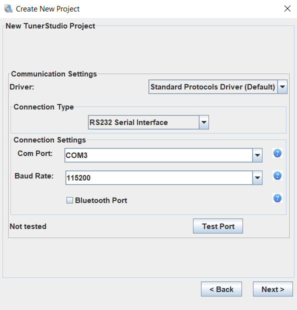

In the final dialog box, select the default gauge layout (you can change this later as you wish) and click _finish_. The last step before cranking the engine is to click the _Ignition_ button to open the ignition settings and change the timing mode from _dynamic_ to _fixed_ and the fixed timing setting to 10 degrees. This will lock the engine to operate at 10 degrees of timing so that you can set the base timing.

### Additional Tuner Studio Steps for an External Wideband Controller

To set up the external wideband controller there are several additional steps in Tuner Studio. First, your display units should be set to AFR for this as already stated. If you forgot to do this earlier, press _CTRL + P_ to open the vehicle properties. Now, open the _Aux Sensors_ dialog under _Sensors_ and the _Full Pinout 3/3_ dialog under _Controllers_. As per the diagram below, set the _AFR ADC Input_ and _ADC Input_ to the pin corresponding with _O2S_ (pin 2C for the example). for the values in the _Aux Linear Sensor #1_ box you need to reference the manual of your wideband controller for what voltages correspond to its AFR outputs. In the example below, 0V corresponds to an AFR of 10.0 and 4.99V corresponds to an AFR of 19.98. Once these are set, click _Burn_.

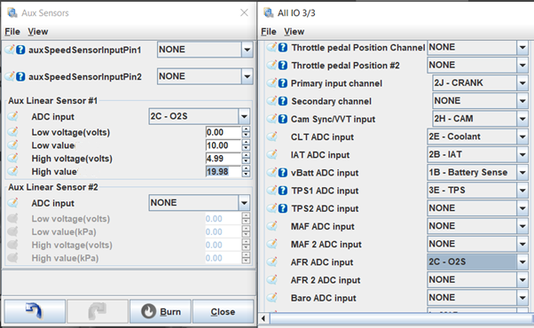

After completing all of the setup steps, you can go ahead and turn the car key two clicks to _ON_ and listed for the fuel pump priming. Once the fuel pump has primed, go ahead and start the engine. Let it run for a few seconds and turn it off again. **Do not drive the vehicle yet, there are still several steps to complete before the car is ready for a drive**.

## Set Base Timing

The car should start on the base map although once it is running, the base timing needs to be set up. This syncs the timing between the ECU and the car so that they are both reading the same values. Typically. the base timing will be a few degrees out from the base map as it varies slightly from car to car.

To set the base timing, connect the timing light power to a spare 12V battery and the inductive clamp onto the cylinder 1 spark plug lead (the closest spark plug to the front of the engine bay). Ensure that the arrow on the inductive clamp is pointing along the wire towards the spark plug, not towards the coil pack.

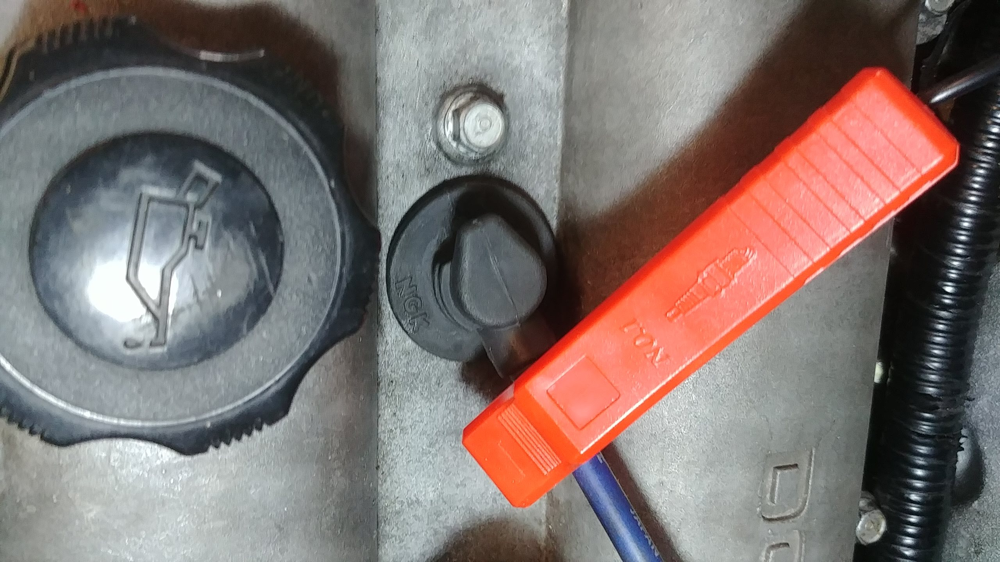

In TS, under _Ignition_ > _Ignition Settings_, set the timing mode to _fixed_ and _10_ degrees then burn the configuration.

Now start the car and hold the timing gun trigger, shining the light onto the bottom harmonic damper pulley on the front of the engine. This pulley has two timing marks on it and a labelled cover above it. When the timing is spot on, these marks on the rotating pulley will line up with the _10_ and _T_ marks on the cover as shown below.

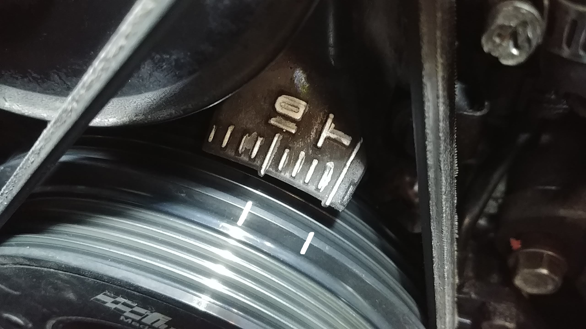

If your timing marks do not line up like in the image above, you will need to change the base timing. Count how many marks the timing is off by and turn the car engine off. In TS, go to _Base Engine_ > _Trigger_ and increase/decrease the _Trigger Advance Angle_ by the amount of marks the timing was off by then burn the configuration. Repeat this process until the timing marks line up then change the timing mode back from _fixed_ to _dynamic_.

## First Drive and Tuning the VE Table

Everything is now ready to take your Miata for its first drive. You can't go and thrash it straight away though as the VE table which determines the fuelling needs to be tuned for your vehicle. Before you take the car for a drive, make sure your laptop is charged.

Start the car and plug the laptop in. Within 30 seconds, the lambda gauge should wake up and start displaying a value. For now, you want that value to be around 1 meaning that the exact amount of fuel is being supplied to the engine for perfect combustion to occur. To change the lambda value, you need to modify the VE Table under _Fuel_ > _VE_. VE stands for volumetric efficiency which is the efficiency that the engine can move the fuel and air mix into and out of the cylinders. An example of a VE table is shown below (do not copy this table as it is off a highly modified vehicle). The table adjusts the VE percentage (represented by the numbers on the grid) based on the engine speed (represented as revolutions per minute - RPM) and engine load (represented as the MAP). With the engine running, blip the throttle and see how the indicator moves around the different table cells as the engine state changes.

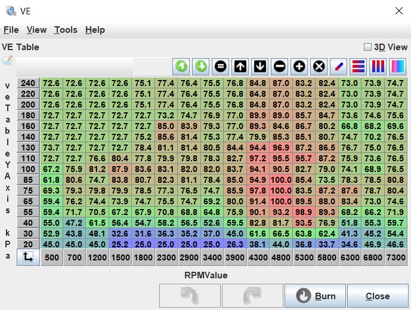

The general way to tune the VE table is to go through all the cells which the engine will operate within and to adjust the VE percentage until the lambda gauge matches the value in the _Target Lambda Table_ shown below and in TS found under _Fuel_ > _Target Lambda_. For example, if the lambda gauge shows 1.1 and the target lambda for that engine state is 1.0, the corresponding VE cell needs to be increased by 10%. The target lambda table supplied with the Miata base map should be sufficient to start with but you can modify it later to make the engine run richer or leaner under certain conditions such as boost or highway cruising respectively.

There are three ways of tuning the VE table. The first way is to drive the car around smoothly as a mate in the passenger seat goes through and changes the VE values until the lambda gauge matches the target lambda. The second and easier way is to use the TS autotuner which is only available in the full version of TS but absolutely worth it. To tune this way, you first need to disable some parameters. Under _Fuel_, open _Closed loop fuel correction_ and _Deceleration fuel cut off (DFCO)_, set them both to false and click _burn_ with the engine off. The third and easiest (yet most expensive option) is to take the car to a dyno for tuning where they will do either the first or second option themselves. The advantage of a dyno is that they can set it to bring the engine into any state they wish to perfectly configure the VE table.

Next, click the tab labelled _Tune Analyze Live! - Tune For You_ to bring up the autotuner. Click to the _Advanced Settings_ tab and configure it as shown in the image below. These configuration settings are deliberately quite loose so that TS can quickly tune the general shape of the VE table. On the left side of the _VE Table Control Panel_, you also need to check the box marked _Update Controller_ which ensures that the VE table is updated on the ECU as the autotune corrects itself.

Now that the autotuner is set up, start the car and click _Start Auto Tune_ on the autotuner. Let the car idle in park whilst it gets up to the minimum temperature. While this happens, you can attempt to change the idle cells in the VE table to get them to a lambda of 1. Once the car has warmed up, **smoothly** drive it around going through the gears and all the way through the rev range. A mix of flat, uphill and downhill driving in different gears is optimal to tune the majority of the engine's operating range. After you are sufficiently happy, click _Stop Auto Tune_, turn the engine off and click _Save on ECU_. You will want to repeat this process several more times, every time dropping the _Cell Change Resistance_ and _Authority Limits_ to slowly refine your VE table.

When you are satisfied with your VE table, turn closed loop fuel correction and _Deceleration fuel cut off (DFCO)_ back to true. You don't actually need DFCO to be enabled although it will save fuel by turning the injectors off when the car is rolling in gear. Your Miata should now be relatively safe to drive but this is only the start of the tuning journey. As you read through the more advanced guides in this wiki, you will learn about all of the different ways the ECU can be configured to improve the drivability and squeeze every drop of performance out of your Miata.
